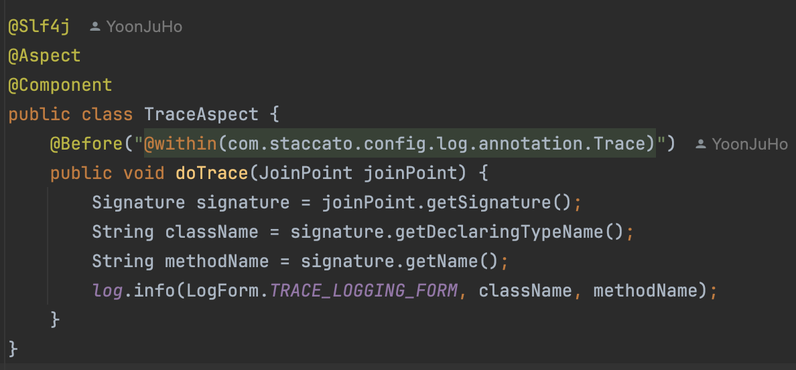
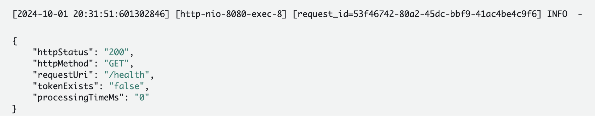
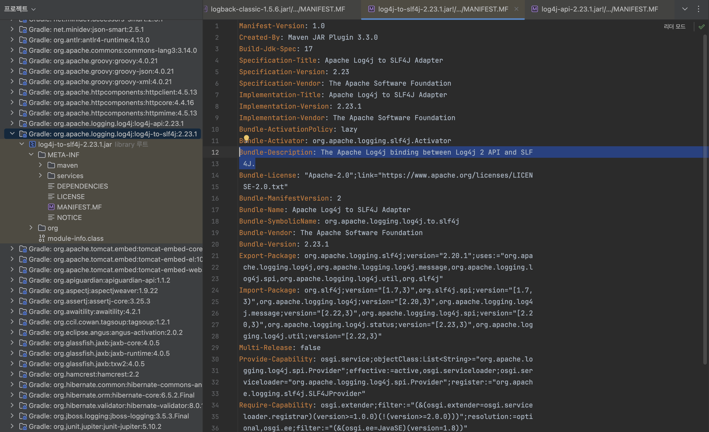
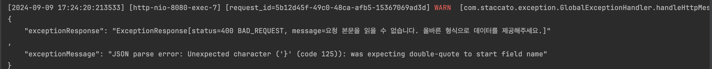
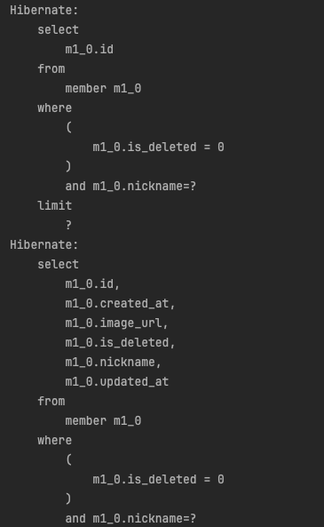
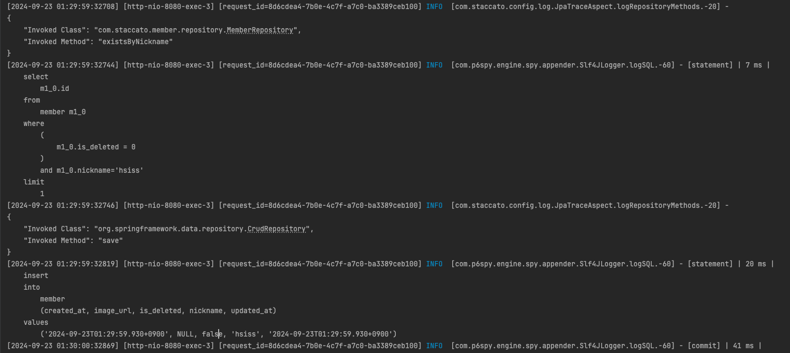

## **문서 작성 계획서**

| 작성자 | 윤주호 |
| :---: | :---- |

# **문서 주제**

Logback을 활용한 로깅 전략 수립하기.

# **대상 독자**

로그에 관한 기본 지식이 있으며, 로깅 전략을 수립하려는 서버(스프링) 개발자

# **문서 활용 계획**

Wiki, 팀 블로그에 공유

---

## 목차
- ### 로깅이란?
- ### 로깅의 주요 요소
- ### 로깅의 3가지 필요조건
- ### 로깅 전략 수립
- ### 로깅 프레임워크
- ### 환경 별 로깅 전략 수립
- ### MDC 적용 코드 분석

---
## **로깅이란?**

로깅(logging)은 프로그램이 실행되는 동안 발생하는 다양한 이벤트, 상태 변화, 오류 등을 기록하는 행위를 의미합니다. 로깅은 개발자나 시스템 운영자가 프로그램의 실행 상태를 모니터링하고 디버깅하는 데 매우 유용합니다.

로깅은 특히 대규모 애플리케이션에서 중요한 기능으로, 서비스가 정상적으로 동작하고 있는지, 어떤 문제가 발생하고 있는지 추적할 수 있도록 돕습니다. 로깅을 통해 얻은 정보는 문제를 해결하고 애플리케이션을 최적화하는 데도 활용됩니다.

## 로깅의 주요 요소

### 로그 레벨 
로그를 중요도에 따라 구분하는 방식으로, 보통 다음과 같은 레벨이 사용됩니다.

- `DEBUG`: 주로 개발 중 디버깅 목적으로 사용. 세부적인 정보를 기록.
- `INFO`: 정상적인 실행 정보를 기록.
- `WARN`: 잠재적인 문제가 발생했음을 알림.
- `ERROR`: 오류가 발생했음을 기록하며, 보통 애플리케이션이 계속 실행될 수 있는 경우.
- `FATAL`: 심각한 오류가 발생해 애플리케이션이 중단될 수 있음을 알림.

### 로그 출력 위치
로그는 다양한 장소에 출력될 수 있습니다.
- `콘솔`: 개발 중 실시간으로 로그를 확인할 때 사용.
- `파일`: 장기간의 기록을 저장해 나중에 분석할 때 유용.
- `원격 서버`: 로그를 중앙화된 시스템에 저장하고, 분석 도구와 연동해 실시간으로 모니터링 가능.
- `로그 포맷`: 로그 메시지는 보통 일정한 형식을 따릅니다. 예를 들어, 타임스탬프, 로그 레벨, 클래스명, 메시지 등을 포함할 수 있습니다.

### 로깅 프레임워크
자바에서는 Log4j, SLF4J, Logback 등의 로깅 프레임워크가 널리 사용됩니다. 이러한 프레임워크는 로그를 남기고, 로그 레벨을 설정하며, 출력 대상을 관리하는 기능을 제공합니다.

**로깅은 개발 및 운영 환경에서 모두 중요한 역할을 하며, 특히 서버 애플리케이션에서 문제 발생 시 이를 신속하게 해결하는 데 필수적인 도구입니다.**

---

## **로깅의 3가지 필요조건**

### 1\. 개발하는 과정과 개발 후에 발생하는 애플리케이션의 문제를 진단할 수 있어야 합니다.

- 이를 위해 로그는 충분히 상세해야 하며, 문제 발생 시 원인을 추적할 수 있는 정보(예: 타임스탬프, 클래스 이름, 메서드, 스택 트레이스 등)를 포함해야 합니다. 또한, 로그의 중요도에 따라 적절한 로그 레벨을 설정하여 중요한 문제와 덜 중요한 문제를 구분할 수 있어야 합니다.


### 2\. 사용자 로그의 경우 분석 데이터로 활용할 수 있어야 한다.

- 이를 위해 로그는 단순한 기록 이상의 정보를 포함해야 하며, 사용자의 행동 패턴, 애플리케이션 사용 빈도, 주요 기능 사용 여부 등을 파악할 수 있는 데이터가 포함되어야 합니다. 
- 이러한 로그 데이터를 적절히 수집하고 분석하면, 사용자 경험을 개선하거나 서비스의 최적화 방안을 도출하는 데 유용하게 활용될 수 있습니다.

### 3\. 방대한 양의 로그 파일이 생성되는 문제를 미연에 방지하여 시스템 장애를 초래하지 않아야 한다.

- 이를 위해 로그 파일의 크기를 제한하고, 일정한 크기에 도달하면 로그를 순환(로그 롤링)하거나 오래된 로그를 삭제하는 정책을 적용해야 합니다. 또한, 로그 저장 주기를 설정하거나 불필요한 디버그 로그를 최소화하여 로그 데이터가 과도하게 쌓이지 않도록 관리해야 합니다. 
- 로그 파일의 저장 위치를 분산하거나 중앙화된 로깅 시스템을 사용하여 시스템 자원의 과도한 사용을 방지하는 것도 중요합니다.

## **로깅 전략 수립**

- 필자는 프로젝트에서 **로깅의 3가지 필요조건**을 적용해 보았습니다. 

### **개발 과정 전후로 발생하는 애플리케이션 문제 진단**

>개발 과정
> 


- 개발하는 과정에서 애플리케이션의 문제를 진단할 수 있어야 하기에 로그 출력용 AOP를 생성하고 포인트컷을 커스텀 애노테이션이 붙은 메서드로 지정하여 특정 메서드에 어드바이스를 적용하였습니다. 
- 이를 통해 개발 과정에서 특정 메서드의 호출 시점과 전달되어지는 인자를 쉽게 모니터링할 수 있어 의도한 방향으로 개발이 진행되고 있는지 확인할 수 있었습니다.

> 개발 과정 후

`Filter`에서 들어오는 요청과 응답에 대한 로깅 수행 → `INFO Level`
- **Http Status**
- **Http Method**
- **Request URI**
- **Token 유무**
- **Processing Time (소요 시간)**


### **사용자 로그 분석 데이터 활용**


사용자 로그 분석 데이터를 활용하기 위해 **MDC(Mapped Diagnostic Context)** 와 **인터셉터에서 사용자 식별 후 로깅**을 구성한 것은, 사용자 별로 발생하는 이벤트를 보다 명확하게 추적하고 분석할 수 있게 해주는 효과적인 방법입니다.

### 1. MDC(Mapped Diagnostic Context) 활용
- 설명: MDC는 로깅 프레임워크(Logback, Log4j 등)에서 제공하는 기능으로, 로그 메시지에 추가적인 컨텍스트 정보를 저장하여 각 요청이 별도의 실행 흐름으로 구분될 수 있도록 해줍니다. MDC는 특정 스레드 내에서만 해당 컨텍스트를 유지하므로, 각 요청에 대해 고유한 정보를 저장할 수 있습니다.
- 활용: 사용자가 애플리케이션에 요청을 보낼 때 MDC를 통해 사용자 식별자(예: 사용자 ID, 이메일)를 로깅할 수 있습니다. 이렇게 하면 로그 분석 시 특정 사용자에 대한 요청 내역을 추적하거나, 사용자 별 행동 패턴을 쉽게 분석할 수 있습니다.


- **장점**
  - 사용자별로 로그를 구분해 각 사용자의 행동을 추적할 수 있음.
  - 오류 발생 시 해당 사용자와 관련된 모든 로그를 쉽게 추적 가능.
  - 다중 사용자가 동시에 요청을 보낼 때 각 사용자의 컨텍스트가 분리되므로, 서로 다른 사용자의 로그가 혼합되지 않음.

### 2. 인터셉터에서 사용자 식별 후 로깅
- 설명: 인터셉터는 요청이 컨트롤러에 도달하기 전에 특정 로직을 처리할 수 있는 메커니즘입니다. 이를 통해 애플리케이션의 모든 HTTP 요청에 대해 공통적인 작업(예: 인증, 로깅, 사용자 식별)을 처리할 수 있습니다. 인터셉터에서 사용자 식별 정보(예: JWT 토큰이나 세션 정보)를 추출하여 MDC에 저장한 후 로깅을 구성할 수 있습니다.
- 활용: 사용자 요청이 들어올 때마다 인터셉터가 먼저 실행되므로, 사용자가 요청할 때마다 인터셉터에서 `loginMemberID와` `loginMemberNickname`을 추출하여 로그에 기록합니다. 이를 통해 각 요청이 어느 사용자인지 명확하게 식별할 수 있습니다.


- **장점**
  - 모든 요청에서 공통적인 사용자 식별 작업을 처리할 수 있어 코드 중복을 줄일 수 있음.
  - 사용자 식별 정보를 중앙 집중화하여 로깅 로직을 간결하게 유지.
  - 다양한 요청 경로에서도 사용자 정보를 일관되게 관리할 수 있음.

**로그 분석 데이터 활용**
- MDC를 통해 사용자 정보를 로그에 포함하면, 이를 기반으로 사용자 행동 분석이나 이상 행위 탐지를 수행할 수 있습니다. 예를 들어, 로그 데이터를 분석하여
  - 특정 사용자가 자주 요청하는 API 엔드포인트.
  - 로그인 시도 실패 기록 및 패턴.
  - 특정 사용자에게서 발생하는 예외 상황.
  - 사용자별 응답 시간과 성능 문제 등.

이를 통해 사용자의 행동을 분석하여 서비스 최적화나 개인화된 서비스 제공에 필요한 데이터로 활용할 수 있습니다. 또한, 보안 관점에서 의심스러운 요청을 특정 사용자와 연결하여 빠르게 탐지할 수 있습니다.

### **이전 로그 파일 관리**
로그 롤링 설정은 로그 파일의 크기와 보관 주기를 관리하여, 방대한 양의 로그 파일이 생성되는 문제를 예방하는 방법입니다.
``` java
<rollingPolicy class="ch.qos.logback.core.rolling.SizeAndTimeBasedRollingPolicy">
    <fileNamePattern>./backup/info/info-%d{yyyy-MM-dd}.%i.log</fileNamePattern>
    <maxFileSize>10MB</maxFileSize>
    <maxHistory>15</maxHistory>
    <totalSizeCap>3GB</totalSizeCap>
</rollingPolicy>
``` 

- **SizeAndTimeBasedRollingPolicy 사용**
  - 설명: 이 정책은 로그 파일이 특정 크기(maxFileSize)에 도달하거나 특정 시간 간격(fileNamePattern)에 맞춰서 새로운 로그 파일을 생성(롤링)하는 정책입니다. 파일 크기와 날짜를 기준으로 동시에 관리할 수 있어, 로그 파일의 크기를 제한하고 파일이 과도하게 커지지 않도록 합니다.

- **fileNamePattern**
  - 설명: 로그 파일의 이름 패턴을 정의합니다. 이 설정은 날짜와 파일의 인덱스를 기준으로 파일 이름을 생성합니다.
    - `./backup/info/info-%d{yyyy-MM-dd}.%i.log`: 여기서 `%d{yyyy-MM-dd}`는 로그 파일의 날짜를 나타내며, `%i`는 파일의 인덱스(같은 날짜에 여러 로그 파일이 생성될 경우 구분)입니다. 예를 들어, `info-2024-10-01.0.log`, `info-2024-10-01.1.log` 같은 식으로 이름이 지정됩니다.
    - 이를 통해 하루 동안 생성된 로그 파일이 인덱스로 구분되어 저장되며, 날짜별로 새로운 파일을 자동으로 생성하여 로그를 효율적으로 관리할 수 있습니다.

- **maxFileSize**
  - 설명: 로그 파일이 최대 10MB에 도달하면 새로운 로그 파일을 생성합니다. 즉, 로그 파일이 10MB 이상 커지지 않도록 관리하여, 단일 로그 파일이 지나치게 커져서 시스템에 부담을 주는 것을 방지합니다.

- **maxHistory**
  - 설명: 이 설정은 로그 파일을 최대 15일 동안 보관한다는 의미입니다. 즉, 15일이 지나면 가장 오래된 로그 파일이 삭제되어, 불필요한 과거 로그 파일이 무한히 쌓이는 것을 방지합니다. 이를 통해 로그 파일의 보관 주기를 관리할 수 있습니다.

- **totalSizeCap**
  - 설명: 모든 로그 파일의 총 크기를 3GB로 제한합니다. 이 설정은 보관 주기와 파일 크기를 넘어서, 로그 파일이 차지하는 전체 저장 용량을 관리하는 데 도움을 줍니다. 만약 총 로그 파일 크기가 3GB를 초과할 경우, 가장 오래된 로그 파일이 삭제됩니다.
종합

이 설정을 통해 로그 파일이 크기, 날짜, 보관 기간, 전체 용량의 기준을 만족하지 않으면 새로운 파일을 생성하거나 오래된 파일을 삭제하게 됩니다. 이런 로그 관리 전략을 적용함으로써, 서버의 저장 공간을 효율적으로 사용하고, 로그 파일이 과도하게 쌓이거나 너무 커져서 시스템 성능에 영향을 미치는 문제를 방지할 수 있습니다.

---

## 로깅 프레임워크
- 로깅 프레임워크는 애플리케이션에서 발생하는 다양한 이벤트, 상태 정보, 오류 등을 기록하고 관리하는 데 사용되는 도구입니다. 로깅 프레임워크는 애플리케이션의 개발 및 운영 과정에서 발생하는 문제를 추적하고 분석하기 위해 필수적인 도구입니다. 특히, 복잡한 시스템에서 발생하는 다양한 문제를 진단하는 데 매우 유용합니다.
- 대표적으로 `Logback` 과 `Log4j2가` 존재하며, 필자는 `Logback` 을 선택하였습니다.

### Logback
`Logback`은 자바 기반 애플리케이션에서 널리 사용되는 고성능 로깅 프레임워크입니다. `Logback은` `Log4j`의 후속 프로젝트로서 개발되었으며, 성능, 유연성, 기능 면에서 개선된 특징을 갖고 있습니다. 특히, `Spring Boot`와 같은 프레임워크에서 기본적으로 채택되어 자주 사용됩니다.

**Logback의 주요 특징**

- **유연한 구성**
  - `Logback`은 `XML` 또는 `Groovy` 파일로 설정할 수 있어 유연한 구성 관리가 가능합니다. 이 설정 파일을 통해 로그 레벨, 로그 파일의 위치, 로그 출력 포맷 등을 정의할 수 있습니다.

- **Rolling Log 파일 관리 (로그 롤링)**
  - 로그 파일이 커지는 것을 방지하기 위해 `SizeBasedRollingPolicy와` `TimeBasedRollingPolicy`를 제공하여 로그 파일을 주기적으로 분할하고, 오래된 로그 파일을 관리하는 기능을 지원합니다. 로그 파일의 크기가 커지면 새로운 파일로 전환되며, 이전 파일을 삭제하거나 압축하여 디스크 공간을 효율적으로 관리할 수 있습니다.

- **SLF4J와 통합**
  - `Logback`은 **SLF4J(Simple Logging Facade for Java)** 를 기본 로깅 인터페이스로 사용합니다. SLF4J를 통해 다른 로깅 프레임워크(Log4j, JUL 등)로 손쉽게 전환할 수 있어, 유연한 로깅 구현이 가능합니다.


### **Logback vs Log4j2** 
`Logback`과 `Log4j2` 중 `Logback`을 선택한 이유는 아래와 같습니다.

### 이유 1
`Log4j2`와 다르게 추가적인 디펜던시가 필요하지 않습니다.

- **스프링 부트는 기본적으로 Logback을 사용하도록 설정**


- **Log4j2를 도입하기 위해서는 아래와 같은 추가적인 디펜던시가 필요**

  `implementation("org.springframework.boot:spring-boot-starter-log4j2")`

  > 주어진 `MANIFEST.MF` 파일은 Apache Log4j 2를 SLF4J에 연결하는 어댑터에 대한 정보를 포함하고 있습니다.
  > 
  >


### 이유 2
`Log4j2`에서 제공하는 메모리 관리나 비동기 로깅으로 얻는 성능적 이점이 
      당장 필요하지 않으며, 프로젝트 규모(실 사용자 1천명 이하)로 봤을 때 성능적 큰 차이가 없다.

### 이유 3
`Logback` 은 `log4j` 에 비해 향상된 필터링 정책, 기능, 로그 레벨 변경 등에 대해 서버를 재시작할 필요 없이 자동 리로딩을 지원한다는 장점이 있다.
- [참고 블로그](https://tecoble.techcourse.co.kr/post/2021-08-07-logback-tutorial/)

### 이유 4
다른 프레임워크에 비해 설정이 간편해서 러닝커브가 적으며, 다양한 레퍼런스가 존재

---

## **환경 별 로깅 전략 수립**
- 필자는 환경 별 로깅전략을 다르게 수립하였는데, 아래와 같다.

### **Prod**
`INFO Level`
- 비즈니스 로직 상 의도한 에러(ex: `StaccatoException - 커스텀 예외`)인 경우

`WARN Level`
- 예상하지 못한 에러면서 **비정상적인 사용자 행동**이나 **잘못된 입력**으로 인해 발생한 예외의 경우(`HttpMessageNotReadableException`, `ForbiddenException`)



`ERROR Level`
- `RunTimeException`
- `DB SQL` 관련 `Exception` 중 크리티컬한(`Error`) 것들만 `GlobalExeptionHandelr`에 등록
  - `CannotCreateTransactionException`
  - `DataAccessException` 
  - `TransactionSystemException`
    


> **Warn 예시**

```java
    @ExceptionHandler(HttpMessageNotReadableException.class)
    @ApiResponse(responseCode = "400")
    public ResponseEntity<ExceptionResponse> handleHttpMessageNotReadableException(HttpMessageNotReadableException e) {
        String exceptionMessage = "요청 본문을 읽을 수 없습니다. 올바른 형식으로 데이터를 제공해주세요.";
        ExceptionResponse exceptionResponse = new ExceptionResponse(HttpStatus.BAD_REQUEST.toString(), exceptionMessage);
        log.warn(LogForm.EXCEPTION_LOGGING_FORM, exceptionResponse, e.getMessage());
        return ResponseEntity.badRequest().body(exceptionResponse);
    }
```

해당 메서드에서 처리하는 `HttpMessageNotReadableException`는 주로 **잘못된 형식의 요청 본문**이 들어왔을 때 발생하는 예외입니다. 예를 들어, JSON 형식이 잘못되었거나 요청 본문을 읽을 수 없는 경우입니다. 이런 경우는 **클라이언트 측 문제**로 인한 오류이며, 서버는 여전히 정상적으로 동작하고 있습니다.

따라서, 이 상황은 **경고(Warn)** 레벨로 로깅하는 것이 적절합니다. 그 이유는 다음과 같습니다:

**왜 `warn` 레벨이 적합한가?**

- **클라이언트 입력 오류**: 클라이언트가 잘못된 데이터를 전송했지만, 서버는 정상적으로 이를 처리하고 응답을 반환할 수 있습니다.
- **치명적이지 않은 문제**: 서버 자체에는 치명적인 문제가 없고, 클라이언트가 요청 형식을 수정하면 정상적으로 다시 요청할 수 있기 때문에 **치명적인 오류**는 아닙니다.
- **경고 필요**: 클라이언트에서 올바르지 않은 데이터가 반복적으로 들어올 경우, 주의가 필요하다는 의미에서 **`warn`** 로그로 기록하여 **잠재적 문제**를 개발자나 운영자가 파악할 수 있도록 합니다.

**`info`나 `error`가 적합하지 않은 이유**

- **`info` 레벨**: 이 경우는 클라이언트의 잘못된 요청을 경고하는 상황이므로, 단순히 정보를 남기는 수준의 `info` 레벨은 적합하지 않습니다. 이는 경고의 의미가 충분히 전달되지 않기 때문입니다.
- **`error` 레벨**: `error` 로그는 서버의 치명적인 오류, 즉 서버에서 더 이상 정상적인 처리나 복구가 불가능할 때 사용해야 합니다. 이 경우는 **클라이언트 오류**로 인해 요청이 실패했지만, 서버는 정상적으로 응답을 처리하고 있으므로 `error` 로그는 적합하지 않습니다.

이와 같은 로깅을 통해 클라이언트의 잘못된 요청이 반복될 때 경고를 기록하고, 나중에 분석할 수 있습니다.

> **Error 예시**
>

```java
    @ExceptionHandler(RuntimeException.class)
    @ApiResponse(responseCode = "500")
    public ResponseEntity<ExceptionResponse> handleInternalServerErrorException(RuntimeException e) {
        String exceptionMessage = "예기치 못한 서버 오류입니다. 다시 시도해주세요.";
        ExceptionResponse exceptionResponse = new ExceptionResponse(HttpStatus.INTERNAL_SERVER_ERROR.toString(), exceptionMessage);
        log.error(LogForm.ERROR_LOGGING_FORM, exceptionResponse, e.getMessage());
        return ResponseEntity.internalServerError().body(exceptionResponse);
    }
```

이 경우는 `RuntimeException`을 처리하고 있습니다. `RuntimeException`은 **예상치 못한 서버 오류**로 인해 발생하는 예외로, 애플리케이션이 정상적으로 처리할 수 없는 **치명적인 문제**를 의미합니다. 이 예외는 애플리케이션의 상태에 **심각한 영향을 미칠 수 있는 예외**로, 서버 내부 오류를 나타내며 사용자에게도 오류 응답을 전송합니다.

**왜 `error`가 적합한가?**

- **치명적인 오류**: `RuntimeException`은 애플리케이션에서 치명적인 오류를 나타내며, 이로 인해 애플리케이션이 더 이상 정상적으로 동작하지 않을 수 있습니다.
- **빠른 조치 필요**: 이러한 오류는 즉각적인 조치가 필요할 수 있으므로, 운영자가 이를 인지할 수 있도록 **error 로그**로 남겨야 합니다.
- **서버의 비정상 상태**: `500 Internal Server Error` 응답 코드를 반환하는 상황은 서버의 비정상 상태를 의미하며, 이는 심각한 문제로 기록되어야 합니다.

**`warn`이나 `info`가 적합하지 않은 이유**

- **`warn`**: `warn`은 경고를 의미하며, 심각하지 않지만 주의가 필요한 상황에서 사용됩니다. 그러나 **`RuntimeException`** 은 경고 수준을 넘어서는 **치명적인 문제**이므로 `warn` 로그로 처리하는 것은 적절하지 않습니다.
- **`info`**: 단순한 정보성 로그로 남기기에는 이 예외는 너무 중요하며, **서버의 비정상 동작**을 나타내므로 `info` 로그는 적절하지 않습니다.

---

### `info`와 `warn` 선택의 기준

- `info` 로그를 사용해야 하는 경우:
  - **예상된 예외**가 발생하고, 이 예외가 애플리케이션의 **정상적인 처리 흐름**에서 문제가 되지 않는다면 `info`가 적합합니다.
  - 커스텀 예외가 자주 발생할 수 있는 상황이면서도, 처리 후 시스템이 정상적으로 동작하고 경고할 필요가 없으면 `info` 로그로 처리하는 것이 맞다는 결론을 도출하였습니다.
- `warn`로그를 사용해야 하는 경우:
  - 예외가 예상된 것이지만, **비정상적인 사용자 행동**이나 **잘못된 입력**으로 인해 발생한 예외라면, 시스템에 큰 문제가 없더라도 **경고**를 남겨야 한다고 생각했습니다.

### **Dev**
- `Prod`환경과 동일하게 로깅을 남기면서 `DB`의 `Query`를 로깅하는 과정이 필요했고, `P6spy`라이브러리를 도입하게 되었습니다. 

### P6spy
`P6Spy`는 `JDBC` 드라이버를 가로채어 SQL 쿼리를 로깅할 수 있도록 지원하는 오픈 소스 라이브러리입니다. `Spring Boot`와 같은 자바 기반 애플리케이션에서 데이터베이스와의 상호작용을 추적하는 데 유용하게 사용됩니다. `P6Spy`는 개발자가 데이터베이스와 관련된 `SQL` 쿼리나 성능 문제를 쉽게 모니터링하고 디버깅할 수 있도록 돕습니다.

### P6spy 도입 전 쿼리 로깅
- 실제 값이 `?`로 표시되어, 어떠한 값을 통해 `SQL`이 나가는지 명확히 판단할 수 없습니다.

여기에 내용을 입력하세요.

### P6spy 도입 후 쿼리 로깅



---

## **MDC 적용 코드 분석**
```java

@Slf4j
@Component
public class LoggingFilter extends OncePerRequestFilter {
    private static final String IDENTIFIER = "request_id";
    private static final List<String> WHITE_LIST = List.of("/h2-console/**", "/favicon/**", "/swagger-ui/**", "/v3/api-docs/**");

    @Override
    protected void doFilterInternal(HttpServletRequest request, HttpServletResponse response, FilterChain filterChain) throws ServletException, IOException {
        StopWatch stopWatch = new StopWatch();
        stopWatch.start();
        MDC.put(IDENTIFIER, UUID.randomUUID().toString());
        String token = request.getHeader(HttpHeaders.AUTHORIZATION);
        try {
            filterChain.doFilter(request, response);
        } finally {
            stopWatch.stop();
            log.info(LogForm.REQUEST_LOGGING_FORM,
                    response.getStatus(),
                    request.getMethod(),
                    request.getRequestURI(),
                    tokenExists(token),
                    stopWatch.getTotalTimeMillis());
            MDC.clear();
        }
    }

    private boolean tokenExists(String token) {
        return !(Objects.isNull(token) || token.isBlank());
    }

    @Override
    protected boolean shouldNotFilter(HttpServletRequest request) throws ServletException {
        String requestURI = request.getRequestURI();
        AntPathMatcher antPathMatcher = new AntPathMatcher();
        return WHITE_LIST.stream().anyMatch(path -> antPathMatcher.match(path, requestURI));
    }
}

```

**1. 클래스 선언 및 어노테이션**
```java
@Slf4j
@Component
public class LoggingFilter extends OncePerRequestFilter {
```
- `@Slf4j`: Lombok 어노테이션으로, 자동으로 log라는 로깅 인스턴스를 생성합니다. 이 인스턴스를 사용해 로그 메시지를 남길 수 있습니다.
- `@Component`: Spring에서 해당 클래스를 **빈(bean)** 으로 등록하기 위한 어노테이션입니다. 이 필터는 애플리케이션 실행 시 자동으로 Spring 컨텍스트에 등록되어 사용됩니다.
- `LoggingFilter extends OncePerRequestFilter`: OncePerRequestFilter를 상속함으로써 모든 HTTP 요청에 대해 단 한 번만 실행되는 필터를 구현합니다.


**2. 상수 선언**
```java
private static final String IDENTIFIER = "request_id";
private static final List<String> WHITE_LIST = List.of("/h2-console/**", "/favicon/**", "/swagger-ui/**", "/v3/api-docs/**");
```
- `IDENTIFIER`: MDC에 저장할 고유한 요청 식별자의 이름으로, "request_id"라는 문자열을 사용합니다. 이를 통해 각 요청에 대한 고유한 식별자를 생성합니다.
- `WHITE_LIST`: 필터를 적용하지 않을 경로들의 목록입니다. /h2-console/**, /swagger-ui/** 등과 같은 경로에 대한 요청은 필터를 우회하도록 설정됩니다.


**3. doFilterInternal 메서드**
```java
@Override
protected void doFilterInternal(HttpServletRequest request, HttpServletResponse response, FilterChain filterChain) throws ServletException, IOException {
  StopWatch stopWatch = new StopWatch();
  stopWatch.start();
  MDC.put(IDENTIFIER, UUID.randomUUID().toString());
  String token = request.getHeader(HttpHeaders.AUTHORIZATION);
  try {
    filterChain.doFilter(request, response);
  } finally {
    stopWatch.stop();
    log.info(LogForm.REQUEST_LOGGING_FORM,
            response.getStatus(),
            request.getMethod(),
            request.getRequestURI(),
            tokenExists(token),
            stopWatch.getTotalTimeMillis());
    MDC.clear();
  }
}
```
- `StopWatch stopWatch = new StopWatch()`: Spring의 StopWatch 클래스는 요청 처리 시간을 측정하는 데 사용됩니다.
- `MDC.put(IDENTIFIER, UUID.randomUUID().toString())`: **MDC(Mapped Diagnostic Context)** 에 고유한 UUID로 생성된 요청 식별자를 저장합니다. 이 식별자는 각 요청에 대해 로그를 남길 때 함께 기록됩니다.
- `String token = request.getHeader(HttpHeaders.AUTHORIZATION)`: 요청 헤더에서 Authorization 토큰을 가져옵니다. 이 토큰의 존재 여부를 로그에 기록하기 위해 사용됩니다.
- `filterChain.doFilter(request, response)`: 필터 체인을 통해 다음 필터나 컨트롤러로 요청을 전달합니다.
- `stopWatch.stop()`: 요청 처리가 끝난 후 소요 시간을 측정합니다.
- `log.info(...)`: 요청 처리에 대한 로그를 남깁니다. LogForm.REQUEST_LOGGING_FORM에 따라 로그 메시지가 구성되며, 응답 상태 코드, HTTP 메서드, URI, 토큰 존재 여부, 처리 시간이 포함됩니다.
- `MDC.clear()`: 메모리 누수 방지를 위해 MDC에서 저장된 값을 삭제합니다.

**4. tokenExists 메서드**
``` java
private boolean tokenExists(String token) {
return !(Objects.isNull(token) || token.isBlank());
}
```
- 이 메서드는 Authorization 헤더에 토큰이 존재하는지 여부를 판단하는 메서드입니다. 토큰이 null이거나 공백이면 false를 반환하고, 그 외에는 true를 반환합니다.


**5. shouldNotFilter 메서드**
```java
@Override
protected boolean shouldNotFilter(HttpServletRequest request) throws ServletException {
String requestURI = request.getRequestURI();
AntPathMatcher antPathMatcher = new AntPathMatcher();
return WHITE_LIST.stream().anyMatch(path -> antPathMatcher.match(path, requestURI));
}
```
- 이 메서드는 필터가 적용되지 않아야 할 경로를 설정하는 메서드입니다.
- **AntPathMatcher**를 사용하여 요청 URI가 화이트리스트 경로와 일치하는지 검사합니다. 일치하는 경우 true를 반환하여 해당 경로에 대한 요청은 필터링하지 않도록 설정합니다.

### 전체적인 동작 흐름
- 요청이 들어오면 LoggingFilter가 실행되며, 각 요청에 대해 **고유한 request_id**를 MDC에 저장합니다.
- 요청이 필터 체인을 타고 처리되는 동안, 필터는 요청 처리 시작부터 완료까지의 시간을 측정합니다.
- 요청이 완료되면 응답 상태, 요청 메서드, 요청 URI, Authorization 토큰의 존재 여부, 처리 시간을 로깅합니다.
- 지정된 화이트리스트 경로는 필터링에서 제외됩니다.
- 로그를 기록한 후 MDC에서 저장된 요청 식별자를 제거합니다.

# **참고**
- [스프링 부트 Logging 공식문서](https://docs.spring.io/spring-boot/reference/features/logging.html#features.logging.logback-extensions)
- [Logback 테코블](https://tecoble.techcourse.co.kr/post/2021-08-07-logback-tutorial/)
- [넷마블 기술 블로그](https://netmarble.engineering/observability-logging-b/)

[image1]: <data:image/png;base64,iVBORw0KGgoAAAANSUhEUgAAAl0AAAAsCAYAAABfYw1mAAAgz0lEQVR4Xu2dZZsVx9aGz784J4K7u7u7u4bgDgkJIbgnhOAWJASJB3d3CRDcPbhHzvkB9fZde1ZP7e6eYRhg3gnX+nBfVV1d1V1d+tTq3rX/9fd//2v++7//KYqiKIqiKK+Bw78dt+6/VHQpiqIoiqK8PlR0KYqiKIqipAEquhRFURRFUdKAVIuuOQu+8Xnw6FHovKIoiqIoipJIqkVX83ZdfYLnXgVt23cymTLnsP4nT5+anLkLmN9v3TIPHz02WbPnMZ06d/Pjvvd+dB4yZ81pDh3+1fqr1ahjatauF4pz6/Ztkz1nXvP4yRN7nC1HXjN23ERz5Ogx06ZdR8vxEyfNX3//bf2SrlmL1qZO3Yah68FHg4dYt33H922ambPnhuK8kyGLadvuPeufMm2GyZWnYCgO7Ny1x/fznJUqV7d+ydvmLVvNqNHj/ONg+vRI/oJFTd36jay/avXa3nEx69+6bbupmPB8Bw4eMm+9k9nMmjPPTxf1fA89wZ8nXyG//nLlKWCGDB0eirdo8RKvDeX3j//zdiazc3di2QoXLl0yw0aM9o8rV61ppk2fFYoHbRLqT8r+/oOHoTjZc+YzLVq1jYsXjHP85ElToFAxM2XqDHtMGbTz2j/+WV7byZQlp/W/36V73DUaNGrm5W2m9ZctX9kUK17G/PnXX2a4l/+8+YvY8B69+vppvvbKgHL/91sZ7TlcjqUu7ty9a92NmzabP/78M5TPlHD12nXz9NmzUHhS7Nm7LxQmnDh5KhT2PKjXYFiQR4+feP08jxk/4TN7XKNmXa8/t7H+73/4yZSrUMWPmzlrLi/+49A1Xhapk85de5qGjZvZOhg8ZGiS8dZv3OTXu+uKv9+AD736Lx1K/yIkVxcpIao/vQyMbaXLVLT+lCzsR4wc7bftF+HzL74MhT2PqL4eRbDPM5fh0q6at4y1OTh4KDZPvQqC7UMY481r4p87b751e/buZ4Jzv5vf5Nr+wYS5NTl69+kfCkuOWnUamC5de5jLV6/6eWUcEP++/QdCaYaPTByvXYjfu++AUHhq2fWK2neqRVenHgOs4Fr+44rQuVfJ6TNnTYZM2W3DcDtUk2YtrfvLipUmd95CoXS16tS3rqQ5euw389X8haF47gQkEw0TIO7tO3fMgUOHrZ/JS+K2btsh7hrXrt/w/RcuXvLSF7f+dzJkjYuHQHCP+w8cZN3BQ4Z5nfGZWbr827jz4Days+fOmzVr11sxFzW4MPEGw9Ijn3waFkXUb+68Bb2Bf7+p37CpHy5lWKZcpchnfvvdLFYQyzmuU9QTH8F4TZu3tufGjptgflm52oZFXe/b734wtes2sH4EuHvu8JEjvr9r915WFEZd5+Sp03HHVavXsu7adRviwg8cjLUt4d2M2fw2WKJUOTvYBK8NGb3FyBdfTrMDIs+P0CKc59vvidWNm7bY419WrvLTuNdx27x73XXrY/kT0YWA4vjS5cvepHDYPE6YMHbs3O2nuXTlinf+in/MIuFFRZcsjIKI8JTrXbx0ORTnytVrdlFEGVy/cTMuzoOHD82Nm7+H0jRq0sK6GTNn9/tgw8bNrUuZ8LxynusGywkon1+PHLV+ueflK7Fy2LNvvx+PSTbq+aKuGSW63LhBV2Cc+u77H60/SqieO3/BG5cuhsJ5Brcu3etSrufOn7d+2tXOXYnxjh0/bp798Yf1375z139+N7197l8T+4sL1zt1+oz1X73GfS5YP+PombNn/Xj0B4kfrPtj3sR1+crV0LU/+ji24AWez41DO3HbqtC2fWzxBNyLeHLM/CP3ZvxmfMfv5ufe/fu2f8gxfeL8hdgztWzdzg8PPoMrutyxmzZHueC/e++ebcMnT8ePKckRbCeDPv7EP/f4yVOzeMnSuPMFC5cIpaf+1m/YZO9Pmezeszd0H0QXRpCLCf2Fsj7vtDPGwSjRFdUngUWjm9Y9R7umLoJpYNjwUaEwIM+urtm7L3Euvf/ggV+XwBwi46i7+Nh34KA//gT7XWpJteiC3gMTG/jrAIsIbq7cBUz5ilV8yxKWA1bldNwt27ZbdUz4xs1bzAZvwsDqQQExYQ/4YJA9RwdmIsNPHMDfwJvg8+Yv7N+rqLdanJSw8nFFF7iNGXUtg4JrFZg99yvTq3esoVF5U6fPtKtnjt0yxkKBJY8wGhiDfo5ciZaYKJhkV61ea++P6h47fqI/8Iu14p+AK7qYGNt1iE2uy779zmzYuNkv5yzZctvyQeQyyEu4W38FPYFL/cvAUbhoSW/FOyYUD9GNBSNxoCluB+5g3kBEF+KGuitUJHZtLK0Sh7rgPP4dO3eZDwYN9leFd+/d9+N16tzdtiP8iJnqNROtrTdu3vT9rDx51sXfLDUTJk6yzzvGE4i0JRYdEk/KCmHPoMJAwQTJPT4a/Kk9h7Xnfe++YiGb99UCPz0EB2XBFV3fLFlmeiUMmBLvyNHf7DMz+RAm4dIPVngiL8rSRXkKbjhQtvTX4IIERHRRvgsWfm2mz5htjzdt2WrrlfKiHglDIOGKpYt2xWqZcmHCYpyQseH6jRtWmE+ZNtM+wwpPhIuldMSoMdZCjp9zWE5xSSPt6cHDR2bdho1+nhmLEL/4hwwd4ZcPE4VMnuC2xz379tmFXI+eff3zKRFdtAU5ru2Nh4CFWOI2bd4qLm1ylgoWDfLc7n3E4slYg9u4aUykunFgwMCP4sLccz/9HFuMT58xyw8DJmmxLFF/THa4pctW8hcxIoIyZYn1L3Dz2bJVTMjwhsK9Nojoog4WLFxsF7OfDhthx3XCpZ5cXNElC3j617sZYws+nmvW7Hl2nG+RcG8RnSBtMF+BInYuwc+9cbNmz23rKHhPiBJdlAULgXXrN1rhM2LUWBvu5lFw25ML+W3fsbNfH8mJrpat24fEMeEYHkqUKm9FV936jW15rl23Pi4eoot6YXwZPXa8rUupT95MESdKdAXHB/e+uIw7zImUG+MYYakRXdmy5/Hnda7NMzRu2tJa/Bg3eS6Je90bixHK9RKedcWq1aZv/4F2rJE4bvt+GV5KdL1OpMGD26kpLLEsYbkaM3aCLdhdu+OVeL4CRW2j5VWNNIZTEasFrskqEBcRQ1jzhFcNSYkuUeRNmsasbS7kp0KlavZ1loQFLV4CnRjrh1yX10LBOC4Sr1KVGn5Y3XqN7MDqDt7pHVd0VfTKSvzyfAx8Z71VNnXGMWUKnA92WLdtfDF5qvVH1YvEa96yrSlZuoL1Y+IPxgMRB5JGxIvAIEV+xMom4Z9Nmhy6lgiu5OAVt0xw+Hv07GOvi9WIiZlwsXiKEOLVZumyFc3I0WNtO6/foEnouggV3By58sWFu2Xmhq9aE8uDWLpEBLjx3DKTcETXfm9FyIqf11zBOuK1uOCGAwsT8h8lulq0jL2WRXTR71s5VgNBJjyZoEV0IXzpF1x36/YdcWkkTuEiJb3FXDVTo1aiEGZhRpoZM+f4E3SwnBDLrgBHhPljQ4nE1XpKrH4iWCElouvXo0dD+Tl/4aI5dSZmORKxI7hW+CgQ12fPnYu7z8JFi60rbxOkzYEIIzd+0AVZDAbHNPoDFhT8YlkAXofLa91WbdpbNynRRfskbXKi687de7ZtMa917tLDvkYj/Hmiq0ixUtbNk6+wfe2Mn+eqUi1mrRYx4Yqu0WPGW5dxS8pA2pRr6Qriii5EJy4WmHnOGxkRXS9CsD6SE13BtBLO4o5FC6IrSvCBvF6kDX2csOAD2nzrNrG3QVGiKymkLyBUX5Wli89D8LvPWq58rJ25bzKwFCO6untjr3sNPjepXiOxHQTvkRrSrejiAeGHn362Hbhk6fJmtTcp0OHknMQVS5fLvfsP7PdC0iH4tiaq0H7+ZaUVZlg9aPA1a9f3vzFigBCzsdyzaLHSdrVG5+vWo7c9V6pMBf/VAsggxQBFxcpqc8AHsZUhYLWT77jo0IWLlvItYbLSdu+LaRorAytdJikmDo4ZfBB5wTJJz7iiS/JN5+7Td4AVqAywDLzBZ4p6PqybTLxYshAKfLfHgBmMx/dPtCHEDJYNXjdGtRu552lvEsOCUL5iVfttCeeC3wuJpYv47mQklimsI3I9VtxJPU+DRk3jzuHK5JAhUzZTvWYdP437GoN7lq9Q1U8DEz//wubLFfrB17nufdxwBBUr3E1emVKWnwwZZsPd5+b7w/zegqaktwru229gXL6J9+uRY88VGi68inNFF9eSwRArGJYmRBfhU6ZOD6WPEl2Sn7xeO4gS1p279jD1Gzax1gz6j5uGiVz8WO0qValuVq5aE7pG8RJlbXr6LPegXUl7oOxlcuYZguUscQhHqEpYlOiS8p2/YFGS9QaMJVEiROJLHTKJr9+w0fqxDpbxhLssHHiFT76oe9LwXSvhTERyTxYF+Js2a2XHTPyUJedGetdGdFJuiFcpD8mD+Kt7YkaOmWil7zxPdEka2+69fsmYHrw21l45Lu9dTyZy2hFlxLe0HLviS8oYP2MQfsZsFjViWWTBjoulhHiu5Z0FGG4eT3SNm/CZLWux8AVFl5tX/PLMWFjEGse8RT2Qh1cjuhLfSNHXFnsiyT0fxB3LWLx8+NEntq3TDwkjb5SlvDZHdOFiKJFy5c0D30327hP+por56tbt8GKUvJEnEV1uvZw4lTrRhcsignGTxXOffgPs98JcVyxd+GfOnmMXL0OHjbTjBmM/30/zHPKt7ao16/xvZV14W+bm9XmkW9GlvLmw8oRguPJ6+emXFXFl36Vbz39EXYilKxj+psDijTpYsnR56JwShokdYcMPIoLnkiI2medJ8pOCKJikmWSZtHmVioCePGVaKJ5LqdIVrOCkbwXPKekL9/ViWqKiS1EURVEUJQ1Q0aUoiqIoipIGqOhSFEVRFEVJA1R0KYqiKIqipAEquhRFURRFUdIAFV2KoiiKoihpgIouRVEURVGUNEBFl6IoiqIoShqgoktRFEVRFCUNUNGlKIqiKIqSBqjoUhRFURRFSQNUdCmKoiiKoqQBKroURVEURVHSABVdiqIoiqIoqaB5u65xdO45MBTHRUWXoiiKoijKC/Dsjz/M/kNHrNDChafP/rDHwbgu6VZ0la9Y1cybv8D68+YvYt5+N4v1T58x2zsubO7dv2/yFyxmypSrZIoUK+2n+/dbGUPXOnPunClRqpzZtGWrefzkiclXoKjJlCVnKF7vPv1Nthx5vIJ7Zv76+29TvGRZ06Zdx1C8FatWm1JlKlj/w0ePTMnS5U3b9u+F4oHkB/edDFnMylVrQnFKl6lo3nons/X/5+1MNh7P58bZum2HKVu+ssmTr7A9Jp/vZMhq/c2atzZFi5c2f/71l6lavba9l9y3UJGS9nnxFyhU3OTKU8D6yX/xEmW9NH+bDu919tOcPnPGlrukr1WngT1esXKVPV67boN1Dx46bB48fBR6lpRw/8FDc/nK1VB4UlAX4icd9SPHX06dHor/PJo0axUKC0K9FipSwmTNntseZ8ycwxQrUcb6+/X/0G8nHwz62Jbl4m+Whq7xslCXtAWgDqBjpy6heLnyFDSZvPxN/PwLr82Ws2HklfzlzF3AnicsR678Xl8pFUqfWvoPHBQKexEuXLxk22wwPLVs2LjJdOve2/QfMMj88eef5vNJk0NxgjB+BMOeB/0oGPY8eM7+Az8MhQdhnKO+WrVuZ4+lzbVs3T5ubNu4eUsobWrJmTu/7x/wwUcmszc2AmMwLmMTLvfPmj2PqVOvUVz6M+fO27EVP20seP2x4yda9+z586FzQV60PhgDKSPmL8Z0yu7U6TN+fjNnzRVKs3Xb9lAYyPPd/P330LnU8Nnn0e2vRcs21h08ZKjfR9/NmM2GkX/awIVLl0Lpnkc1b7zAHTlqbOjci8CcEQxzqVy1ph2TCxYuHjnfQlLhbxI/rVhjOnbrZz4cMsrSqfsAs+z7X/65oqtNu3gR06dfzGRXumxFM3/BIr+RglRw4aIlIyubMMQW7pKly61YKFehSihe+47vm569+tpGdf7CBduRRey5MICK6Areb/KXU31//YZNTM6EQSgY75Mhw+KO33s/VlGff/FlXPjHgz+NO2YQQRDgR+yRR4Qax+5gUaBQMTNu/GfWz71/v3XL+kWwfPvdDwn37eancZ/VFV0SxkQ2fsLn1kV0IQznL1xkzx08dMiMGDXGHDh4yHZIVxwgUkWUbNm63UyY+PkLiS7yLPXP9e/eu2/zAHXqNrQuYY+fPDVTp88Mpefec+Z+5QnKs2b7jl1xAunkqVN+WbhMnjLV3pcJtkXLtracKZMnT5+a7DnzeW3ooRUNDJJyLngNynzZ8u/9PODS/nB7eQL/xs1YfVEWffoOCKVHdAXDokQXTJo8xbqILvIoouvO3bt+nM0JE2NUGbncuXvP9PD6QTAc2nXoZHbs2mXrmHZH2RP+6PFjM3J04mBPfpj88M+aPc98vXiJ9V/0JhOZjHbv2WvTSZoPBg32rhseh4hD38TP/cS/bv0G2xeOHD1mj6kDyQ/lfenyFf8ai75eYpYu+y50bakf4Fpybdi8ZVukmHZFF/ejTOT4nCcs5i/42vqvXrtu+8tZT5RwHckn/us3b5pr12/49502Y5b1V6lWy78W8ZZ/m5g/t419OWWa/6zUd/sO79t2eP7CRVvvrdt08OM+D1d0gbvIgRq16llX7o9YcM8juliU/HrkqC+6aKdchzwyZuMiusijLFDJN+Uj15k5a26kSLLnZs8Nhd26fdv3c90pgQVYUtdKTnTh1vbGFNzeXp+UcZO+PmHiJOvftDnWj347fsK6nTp38+ti0MefmAULY/XPPCLhLkHRhX/fgYP++UpVaoTSwJSpM0JhgvRz7scCXO57/cYN071nHzv/SR9dsXK12blrjz3PeIy7as1av7+MGTfBvy5zSof3upgjx37zw3bs3OX7u3TrEcoLRI2HbxqIri+nJ7bLmXMXvTmi6/iJk/7gPNBbie3avcev1ExZcliXgYHBi3CehYYGnGOS7Nt/oKntCQgmgtZtO5h8BYrYc268BQsXm0tXrthr3H/wwAqwPv3CkyEERVdQnGEBuXX7jsnh3VsGMYRclKWrVJnYoCTH33gTM9agYLwMmbJbd+eu3V5j72mfE+FDXpq3aONfo16DJtZt65UhAyomT9LQWb774Sd7rmLl6iZLtlx2sOR4+MjRcfeKEl2ANQUX0bVl6zYzY+Yce1ywcAnrHjp8xKalY3fr0dsTwjHLCitI8keeoyxdiATBDQdEAO627Tu9gf2IV8+JE3XdhFU3bYT87Nm734oZqdcrV6/5z4K1E1eeibwg4vAzqEuavfv2m8O/HrF+BjAsqmPHTbSi7oY3WTIos8JmwFy2/Dub57r1G3uD1uW49jRqzHjz08+/+AO35EPKp4hXNpSJKw4kvbSZ4ydPxQ1gKRFdsvonf4TPmDXHXu/2nTs2jpRDFPSzK1ejBTGT3NyvYtZnELFPmn37EycNd0F0/ERsYopivzfRYKJ3rxU1WMuzgbRXrBrUAxO3W64Sj+ddvWZdXDjWj+C1XdH1fpfu1mXxJhbBqPy4okssz+Rnnlc2LMj6DRhkw6S9L132rT3+bFJsQeXmF/GOKGNSJwzrAfUl5ZItR17/Xm5epjnCGVFDe8Ii9b3Xv8kD/UTOC27bdGGMWLV6rYXj5ERX4SIlzNBhI+POI7p2eOMLVnREl7RvGRPFeoXo+v7Hn/10vEnA5c1F566xyftFLF289cClvVPOLVq1tWUn51MjurLnjJX3N0uW2WeQhS11KVbZps1jlvIp02b4zyp1Q1nJG4AqVRMFtEtQdFWqXMNM+iKxjSclupKjcdOWvp8xS/zjPFFLH0F0yQKCNyaMV/iHDR9lw3kGqWdXdLGodIU/47j4mVOS0g1R/eZNI0p0yXddwbgu/wjR1aZtR98vlVmmbKXIySOqst/NGHsNx7kcufJZ/4yZsQ4blZbBt2HjZtaPOAnGAxFdMsFIY3RX7iCWLmHI0OHWZbCVMNcvYJVxz53wJl85R13NmjPXCkOO5TXP5C+nWbdv/w+sywCMABkxcowdxIcOjx8s4YcfYyIMAeCGS1kERRfWLFx5vTh77jx7PMy5tqQln1mzxV7PESZCi9V8UHQx2AluOMgkgOg6eep03KtXXoHgIroIj6ovyU/J0rE6c59pzdr1Np8//PRLXBp5dcurKoQmVphmLVrbvMhKuGu3Xv61o/I9b/5C34/Y5zW4KxKA623ctDmU1sWNnxLRJWmClq4vEqywSU06gLBkwnHDpA2KqBeBJC5WRtqiiDoRRnD5SqKgFMZNiFlgj3mDD+WBXyZoeVZ3ESLC2r0nr32lHiRNsFxFdEkaEV08o8RzRZdMdiyCgtd0X4O6oosFHS5iA4sHbYk0Mp4ymS1dHrOwRYkuFmZMiEzuhLmWLkhKdH21IGZhBneSps+76VPCi1q6giC6cOmflIN8KiHIswVfL/LZCC6vs3jFltw9pJ240C75PGLI0BGvzNLFdVgYL1kWs0iDtMVFX39j3UZNWtj2gOhyP1OROm/WIiaqWOQH7wEYAHCbNm/tW7pkQQ1JiS7aSTAMaibUjyALYEAYiZ9FDgtDRBfPJNZsFgXuJxuu6AKeK0OmbObosd+s9ZYw2ogI5SiSqsc3iSjRhaUrGC/IP0J0MYjD2XPnbMcVoSPh7iDv+l2YRLGEYS7FH/XqZoM3+WVIuDaNknhi9neRe2LlkGszeOJnperGlWM6lWsBkEmdCct9BuK4HVDijR47Pi4ecWTAx7Il8WCms9pDcGIdxC/pmSDpRG5+mDDED9JpgqKrXftO1mx++MhRa3HiVS/ho8aM8+Mg8Lj2iZMnrXUEvwhk/DzzlWvX4q6bHDIJiFmbwVRWxJj8M3plgeiiTK5GXFfKrEKlatZt0KipyZ23kPXzmle+eXLBQkaZMsBynM0T1VOnxawLWBl5DvJFmySeDEYuCHvyRFsSC55bz5QjfsrOrQuhRs16/n0kLEp0Sb3yOllem2OpYSC9e++eH69Hr37+AiQ5sCBEtVVeQRCOkOAYUSPxsDivWr3GnDt/IeE4p/89JGWQMXOsTRPfnUDJN+LLxnPuSZ3Ic2ONlPuwqBF/44S6kTJ1+z5p5ZhXyOQBy67kQeIhUohHHR09dtw/x6SKX/pBo8bN/TRS3k2atrQLD0nDGIq/Q8fO/n1o/2JBIg3PEswvZcN3p/iD/Y040lbxy2JPrk9fOnX6tPWz6Prx5xVx6VNC/oJF446Doqteg5hVxC1fF6lz91rkZ9To2Jgwd94Ce4yl30137fp1f6zjnnnzFY4cl3nlLGNdEESeWLqkXuScfL8aZNv2HaEwCNYLeZb+hF8WMFU9YdygUTPfqsa5Tz4d7o97MtbRpty25kKely7/1rdo8vzUrTyDWD5dXCuTC/3OPV6/YaNfXrzCl3DKmgWVzEluWWEt9cfUzyb55xCAPMPefQdMYedbr4uXLofK2yX45udNZMfufaFfLm7ZHpujkiPdii5WTRAMV14vvD5zy57vNPAfjnhdkZ5gQE/th/3/BKRO5DsSJeXwPWCUVTw5Fi3+xr7+Clquk2Pv/gPWqnPkaOz7FyYysXokBZMulgesJsFzSvoiKEYVJTWkW9GlKIqiKIryJqGiS1EURVEUJQ1Q0aUoiqIoipIGpEvRxYaXQvBcan8VwfYFwbAgcs+on8wHNwR8WV62vPlBQNTGktMTfpXJFgiLlyzzn4lfG4qfvapw58ydH0oPHTt1NTVq1bV+91dkQdxfvLwsfDvGB8Xy3US/AR/aj9nx9/f88qvJIF279wqFAc8Xtf/Wq+JFvvWBYJtOaTvmBwLP+yhVfp33orj7dfGhf3LbOyiKoigvT7oUXTDww49DYZDSySo1vM5rB5GNEVMLH7xHiS75NRA7puPKL/YE2XNFnlX20XJxf/E25NPYFhdRvMrdzaX91anX0G7RwC/cRGwg7gYPGWZ2Ob/EEZISXT+vWGmvGfw16f8n9RP2T3sR1qyN/QPA83jRtsuvzKR8V6+Nba0Q9S8NiqIoyqsj3YsutgDgr2fYt0o2RZWfsOfKXcBaRkqULGeGjRhlt3e4fSdxXyKXMWMnWJetEWQn8CBc290Xp1Xr9nbjQvzu3/ywJ1NKyyupeK7oworGT3DxszEnrmzqyfNVq1EnlD450cVPzMX6kZzookz3H4htDurCXkENGja1fld0yc/BZYJ3RZfsfbR4yVJbP/JT6CDJ/QJI9thi3x4sPEe9xrl+wyZz7cZNu4Go7J3mkpTo4tdn7O6/Zdt2k8crD36eXrtuA19kys/JXSsSz0P+eD5+Ki77TsG06bPiri/PJ2XBJpm0kSdPn/kbrgZxRZekE5HMXjls5cE/CZAHfo3p7k9FfDallDw1aZa4GSLQzqLqMjnk2fmpOhsqJtVWFUVRlFdDuhdd23bs9Hf0RjDEhFHMiuOu7hFduEltICeiC06cOh35SiZoLWCTP7le8L8Vq1arnaSwSAmu6HL3ZNmzd5913Z3Uo0hOdOGm1NKVFIienZ7IdUWXpIkWXU+sWEB0cUx5/3Y81rhSAuUrrysrV6npiZhC9hUjrzdls0X3L0OEpEQXli7xI7p8f77YDuL8tQ9u46axvZ5ANpcVeCX7n7cTy8kts6Do4n8a2S8Mv7txpUtyoouNXRFdQz4d4cfhXwbEj5AdM3Z83PVyO/uL0X/ZZ8o9/zxEdNX3BDY78C9M2PxRURRFeT2ke9EFTA5i3WKyunf/gd1EkO+AsOqwEdzzRFfmrDnNosVLTPkKVa3lKOo7Ga7N7sxY1uSvHmRyRBTIhM2GfLVqN/BFD7spuxYygY073f+jc8mSLbe/I7Mruthsjtc8iC7ygQUi6q9xXqfo6vheF5seEYXlkFd05y9etJvn8aySdrQnrGQzQ8qNyRvRxUaZWAlJE7x27rwFQ5skSn64BnBfylPuQ/3yXFFt9EVFF99iYSEVSxf/r8ZfQrFbM/do2KiZbRtsRMhfZSD4yC917wp1RCGuK7omT5lmn4/NBYP5gaDoYof6oOgqVbqCKVGKvZ6O2ucVIRoUXbR7t13I5qNBsE4ioIPh7ORPHqRNYwFOrk0oiqIoL0+6FV2K8k8DQcoO9kn9/UhqQHQh5ILhLuzkHQxTFEVR0h8quhRFURRFUdIAFV2KoiiKoihpgIouRVEURVGUNEBE1/8BesCC3VKLyssAAAAASUVORK5CYII=>
