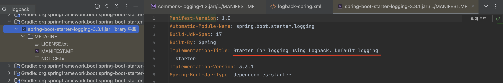

## **문서 작성 계획서**

| 작성자 | 윤주호 |
| :---: | :---- |

# **문서 주제**

Logback을 활용한 로깅 전략 수립하기

# **대상 독자**

- 로그에 대한 배경지식이 있는 서버 개발자
- 로그 전략 수립에 어려움을 겪고 있는 서버 개발자
- 로깅 프레임워크 선정에 어려움을 겪고 있는 서버 개발자


# **문서 활용 계획**

Wiki, 팀 블로그에 공유

---

## 작전에 실패한 장수는 용서할 수 있어도, 경계에 실패한 장수는 용서할 수 없다.

개발을 진행하다 보면 수많은 오류와 예외 상황을 마주하게 됩니다. 아무리 잘 설계하고 최선을 다하더라도, 서비스 안정성을 완벽히 보장할 수는 없으며, 일부 장애는 피할 수 없는 현실입니다.
**'작전에 실패한 장수는 용서할 수 있어도, 경계에 실패한 장수는 용서할 수 없다'** 는 말처럼, 서비스 운영에서는 문제를 예측하고 대비하는 것이 필수적입니다. 그러나 그보다 더 중요한 것은 예기치 않은 장애가 발생했을 때 이를 정확하게 파악하고 신속하게 대응하는 것입니다.

이 글에서는 스타카토(기록 서비스) 팀 프로젝트를 진행하며 마주했던 다양한 오류와 예외 상황들을 정확히 파악하고 해결하기 위해 수립한 로깅 전략을 공유하고자 합니다.

목차는 아래와 같습니다.
- **Spring 애플리케이션의 로깅 프레임워크 선택 기준과 그 특징**
- **팀 프로젝트에서 정의한 로깅의 3가지 필요조건**
- **개발 및 운영 환경에 맞춘 차별화된 로깅 전략**
- **결론**
- **참고 문서**


---

## Spring 애플리케이션의 로깅 프레임워크 선택 기준과 그 특징
> 로깅 프레임워크는 애플리케이션에서 발생하는 다양한 이벤트, 상태 정보, 오류 등을 기록하고 관리하는 데 사용되는 도구입니다. 로깅 프레임워크는 애플리케이션의 개발 및 운영 과정에서 발생하는 문제를 추적하고 분석하기 위해 필수적인 도구입니다. 특히, 복잡한 시스템에서 발생하는 다양한 문제를 진단하는 데 매우 유용합니다.

- 대표적으로 `Logback` 과 `Log4j2가` 존재하며, 필자는 `Logback` 을 선택하였습니다.

### Logback
`Logback`은 자바 기반 애플리케이션에서 널리 사용되는 고성능 로깅 프레임워크입니다. `Logback`은 `Log4j`의 후속 프로젝트로서 개발되었으며, 성능, 유연성, 기능 면에서 개선된 특징을 갖고 있습니다. 특히, `Spring Boot`와 같은 프레임워크에서 기본적으로 채택되어 자주 사용됩니다.

**Logback의 주요 특징**

- **유연한 구성**
  - `Logback`은 `XML` 또는 `Groovy` 파일로 설정할 수 있어 유연한 구성 관리가 가능합니다. 이 설정 파일을 통해 로그 레벨, 로그 파일의 위치, 로그 출력 포맷 등을 정의할 수 있습니다.

- **Rolling Log 파일 관리 (로그 롤링)**
  - 로그 파일이 커지는 것을 방지하기 위해 `SizeBasedRollingPolicy와` `TimeBasedRollingPolicy`를 제공하여 로그 파일을 주기적으로 분할하고, 오래된 로그 파일을 관리하는 기능을 지원합니다. 로그 파일의 크기가 커지면 새로운 파일로 전환되며, 이전 파일을 삭제하거나 압축하여 디스크 공간을 효율적으로 관리할 수 있습니다.

- **SLF4J와 통합**
  - `Logback`은 **`SLF4J`(Simple Logging Facade for Java)** 를 기본 로깅 인터페이스로 사용합니다. `SLF4J`를 통해 다른 로깅 프레임워크(`Log4j`, `JUL` 등)로 손쉽게 전환할 수 있어, 유연한 로깅 구현이 가능합니다.


### **Logback vs Log4j2**
`Logback`과 `Log4j2` 중 `Logback`을 선택한 이유는 아래와 같습니다.

**이유 1**

`Log4j2`와 다르게 추가적인 디펜던시가 필요하지 않습니다.

- **스프링 부트는 기본적으로 `Logback`을 사용하도록 설정**
  

- **`Log4j2`를 도입하기 위해서는 아래와 같은 추가적인 디펜던시가 필요**

  `implementation("org.springframework.boot:spring-boot-starter-log4j2")`

  > 주어진 `MANIFEST.MF` 파일은 Apache Log4j 2를 SLF4J에 연결하는 어댑터에 대한 정보를 포함하고 있습니다.
  > 


**이유 2**

`Log4j2`에서 제공하는 메모리 관리나 비동기 로깅으로 얻는 성능적 이점이
당장 필요하지 않으며, 프로젝트 규모(실 사용자 1천명 이하)로 봤을 때 성능적 큰 차이가 없습니다.

**이유 3**

`Logback` 은 `Log4j` 에 비해 향상된 필터링 정책, 기능, 로그 레벨 변경 등에 대해 서버를 재시작할 필요 없이 자동 리로딩을 지원한다는 장점이 있습니다.
- [참고 블로그](https://tecoble.techcourse.co.kr/post/2021-08-07-logback-tutorial/)

**이유 4**

다른 프레임워크에 비해 설정이 간편해서 러닝커브가 적으며, 다양한 레퍼런스가 존재합니다.


---

## **팀 프로젝트에서 정의한 로깅의 3가지 필요조건**
>JAVA 17, SpringBoot 3.3.1 을 기준으로 설명합니다. 

### 1\. 발생하는 애플리케이션의 문제를 진단할 수 있어야 합니다.
> 로그는 충분히 상세해야 하며, 문제 발생 시 원인을 추적할 수 있는 정보(예: 타임스탬프, 클래스 이름, 메서드, 스택 트레이스 등)를 포함해야 합니다. 또한, 로그의 중요도에 따라 적절한 로그 레벨을 설정하여 중요한 문제와 덜 중요한 문제를 구분할 수 있어야 합니다.

**1.1 로그 AOP 적용**

``` java
@Slf4j
@Aspect
@Component
public class TraceAspect {
    @Before("@within(com.staccato.config.log.annotation.Trace)")
    public void doTrace(JoinPoint joinPoint) {
        Signature signature = joinPoint.getSignature();
        String className = signature.getDeclaringTypeName();
        String methodName = signature.getName();
        log.info(LogForm.TRACE_LOGGING_FORM, className, methodName);
    }
}
```

- 개발하는 과정에서 애플리케이션의 문제를 진단할 수 있어야 하기에 로그 출력용 AOP를 생성하고 포인트컷을 커스텀 애노테이션이 붙은 메서드로 지정하여 특정 메서드에 어드바이스를 적용하였습니다. 
- 개발 과정에서 특정 메서드의 호출 시점과 전달되는 인자를 쉽게 모니터링할 수 있어 의도한 방향으로 개발이 진행되고 있는지 확인할 수 있습니다.

> - 포인트컷은 어디에 로직을 적용할지 정의하는 부분입니다.
> - 커스텀 애노테이션은 사용자가 직접 정의한 애노테이션으로, 특정 목적을 가지고 코드에 적용할 수 있습니다.
> - 어드바이스는 실제로 적용할 로직을 정의한 부분입니다. 포인트컷에서 지정한 조건에 따라 실행될 구체적인 작업을 의미합니다.


**1.2 Filter에서 로깅**


- **Filter**는 애플리케이션의 가장 외부에 위치해 모든 요청을 처음으로 처리하고 마지막으로 응답을 처리하는 역할을 하기 때문에 애플리케이션의 전반적인 흐름을 추적하기 용이합니다.


### 2\. 사용자 로그의 경우 분석 데이터로 활용할 수 있어야 한다.
> 로그는 단순한 기록 이상의 정보를 포함해야 하며, 사용자의 행동 패턴, 애플리케이션 사용 빈도, 주요 기능 사용 여부 등을 파악할 수 있는 데이터가 포함되야 합니다.
로그 데이터를 적절히 수집하고 분석하면, 사용자 경험을 개선하거나 서비스의 최적화 방안을 도출하는 데 유용하게 활용될 수 있습니다.

**2.1 MDC(Mapped Diagnostic Context) 활용**


- **MDC**는 로깅 프레임워크(`Logback`, `Log4j` 등)에서 제공하는 기능으로, 로그 메시지에 추가적인 컨텍스트 정보를 저장하여 각 요청이 별도의 실행 흐름으로 구분될 수 있도록 해줍니다. 
- **MDC**는 특정 스레드 내에서만 해당 컨텍스트를 유지하므로, 각 요청에 대해 고유한 정보를 저장할 수 있습니다.
  - 사용자별로 로그를 구분해 각 사용자의 행동을 추적할 수 있음.
  - 오류 발생 시 해당 사용자와 관련된 모든 로그를 쉽게 추적 가능.
  - 다중 사용자가 동시에 요청을 보낼 때 각 사용자의 컨텍스트가 분리되므로, 서로 다른 사용자의 로그가 혼합되지 않음.

**2.2 인터셉터에서 사용자 식별 후 로깅**


- 인터셉터는 요청이 컨트롤러에 도달하기 전에 특정 로직을 처리할 수 있는 메커니즘입니다. 이를 통해 애플리케이션의 모든 `HTTP` 요청에 대해 공통적인 작업(예: 인증, 로깅, 사용자 식별)을 처리할 수 있습니다.
- 사용자 요청이 들어올 때마다 인터셉터가 먼저 실행되므로, 사용자가 요청할 때마다 인터셉터에서 `loginMemberID와` `loginMemberNickname`을 추출하여 로그에 기록합니다. 이를 통해 각 요청이 어느 사용자인지 명확하게 식별할 수 있습니다.
  - 모든 요청에서 공통적인 사용자 식별 작업을 처리할 수 있어 코드 중복을 줄일 수 있음.
  - 사용자 식별 정보를 중앙 집중화하여 로깅 로직을 간결하게 유지.
  - 다양한 요청 경로에서도 사용자 정보를 일관되게 관리할 수 있음.


### 3\. 방대한 양의 로그 파일이 생성되는 문제를 미연에 방지하여 시스템 장애를 초래하지 않아야 한다.
> 로그 파일의 크기를 제한하고, 일정한 크기에 도달하면 로그를 순환(로그 롤링)하거나 오래된 로그를 삭제하는 정책을 적용해야 합니다. 또한, 로그 저장 주기를 설정하거나 불필요한 디버그 로그를 최소화하여 로그 데이터가 과도하게 쌓이지 않도록 관리해야 합니다.
로그 파일의 저장 위치를 분산하거나 중앙화된 로깅 시스템을 사용하여 시스템 자원의 과도한 사용을 방지하는 것도 중요합니다.

``` java
<rollingPolicy class="ch.qos.logback.core.rolling.SizeAndTimeBasedRollingPolicy">
    <fileNamePattern>./backup/info/info-%d{yyyy-MM-dd}.%i.log</fileNamePattern>
    <maxFileSize>10MB</maxFileSize>
    <maxHistory>15</maxHistory>
    <totalSizeCap>3GB</totalSizeCap>
</rollingPolicy>
``` 
- 로그 롤링 설정은 로그 파일의 크기와 보관 주기를 관리하여, 방대한 양의 로그 파일이 생성되는 문제를 예방하는 방법입니다.
- 이 설정을 통해 로그 파일이 크기, 날짜, 보관 기간, 전체 용량의 기준을 만족하지 않으면 새로운 파일을 생성하거나 오래된 파일을 삭제하게 됩니다. 이런 로그 관리 전략을 적용함으로써, 서버의 저장 공간을 효율적으로 사용하고, 로그 파일이 과도하게 쌓이거나 너무 커져서 시스템 성능에 영향을 미치는 문제를 방지할 수 있습니다.

---

## **개발 및 운영 환경에 맞춘 차별화된 로깅 전략**
- 필자는 환경 별 로깅전략을 다르게 수립하였는데, 아래와 같습니다.

### **Prod (운영 환경)**
`INFO Level`
- 비즈니스 로직 상 의도한 에러(ex: `StaccatoException - 커스텀 예외`)인 경우

`WARN Level`
- 예상하지 못한 에러면서 **비정상적인 사용자 행동**이나 **잘못된 입력**으로 인해 발생한 예외의 경우(ex: `HttpMessageNotReadableException`, `ForbiddenException`)


`ERROR Level`
- `RunTimeException`
- `DB SQL` 관련 `Exception` 중 크리티컬한 것들만 `GlobalExeptionHandelr`에 등록
  - `CannotCreateTransactionException`
  - `DataAccessException` 
  - `TransactionSystemException`
    


> **WARN 예시**

```java
    @ExceptionHandler(HttpMessageNotReadableException.class)
    @ApiResponse(responseCode = "400")
    public ResponseEntity<ExceptionResponse> handleHttpMessageNotReadableException(HttpMessageNotReadableException e) {
        String exceptionMessage = "요청 본문을 읽을 수 없습니다. 올바른 형식으로 데이터를 제공해주세요.";
        ExceptionResponse exceptionResponse = new ExceptionResponse(HttpStatus.BAD_REQUEST.toString(), exceptionMessage);
        log.warn(LogForm.EXCEPTION_LOGGING_FORM, exceptionResponse, e.getMessage());
        return ResponseEntity.badRequest().body(exceptionResponse);
    }
```

해당 메서드에서 처리하는 `HttpMessageNotReadableException`는 주로 **잘못된 형식의 요청 본문**이 들어왔을 때 발생하는 예외입니다. 예를 들어, `JSON` 형식이 잘못되었거나 요청 본문을 읽을 수 없는 경우입니다. 이런 경우는 **클라이언트 측 문제**로 인한 오류이며, 서버는 여전히 정상적으로 동작하고 있습니다.

따라서, 이 상황은 **경고(`WARN`)** 레벨로 로깅하는 것이 적절합니다.

**왜 `WARN` 레벨이 적합한가?**

- **클라이언트 입력 오류**: 클라이언트가 잘못된 데이터를 전송했지만, 서버는 정상적으로 이를 처리하고 응답을 반환할 수 있습니다.
- **치명적이지 않은 문제**: 서버 자체에는 치명적인 문제가 없고, 클라이언트가 요청 형식을 수정하면 정상적으로 다시 요청할 수 있기 때문에 **치명적인 오류**는 아닙니다.
- **경고 필요**: 클라이언트에서 올바르지 않은 데이터가 반복적으로 들어올 경우, 주의가 필요하다는 의미에서 **`WARN`** 로그로 기록하여 **잠재적 문제**를 개발자가 파악할 수 있도록 합니다.

**`INFO`나 `ERROR`가 적합하지 않은 이유**

- **`INFO` 레벨**: 이 경우는 클라이언트의 잘못된 요청을 경고하는 상황이므로, 단순히 정보를 남기는 수준의 `INFO` 레벨은 적합하지 않습니다. 이는 경고의 의미가 충분히 전달되지 않기 때문입니다.
- **`ERROR` 레벨**: `ERROR` 로그는 서버의 치명적인 오류, 즉 서버에서 더 이상 정상적인 처리나 복구가 불가능할 때 사용해야 합니다. 이 경우는 **클라이언트 오류**로 인해 요청이 실패했지만, 서버는 정상적으로 응답을 처리하고 있으므로 `ERROR` 로그는 적합하지 않습니다.

이와 같은 로깅을 통해 클라이언트의 잘못된 요청이 반복될 때 경고를 기록하고, 나중에 분석할 수 있습니다.

> **ERROR 예시**
>

```java
    @ExceptionHandler(RuntimeException.class)
    @ApiResponse(responseCode = "500")
    public ResponseEntity<ExceptionResponse> handleInternalServerErrorException(RuntimeException e) {
        String exceptionMessage = "예기치 못한 서버 오류입니다. 다시 시도해주세요.";
        ExceptionResponse exceptionResponse = new ExceptionResponse(HttpStatus.INTERNAL_SERVER_ERROR.toString(), exceptionMessage);
        log.error(LogForm.ERROR_LOGGING_FORM, exceptionResponse, e.getMessage());
        return ResponseEntity.internalServerError().body(exceptionResponse);
    }
```

이 경우는 `RuntimeException`을 처리하고 있습니다. `RuntimeException`은 **예상치 못한 서버 오류**로 인해 발생하는 예외로, 애플리케이션이 정상적으로 처리할 수 없는 **치명적인 문제**를 의미합니다. 이 예외는 애플리케이션의 상태에 **심각한 영향을 미칠 수 있는 예외**로, 서버 내부 오류를 나타내며 사용자에게도 오류 응답을 전송합니다.

**왜 `ERROR`가 적합한가?**

- **치명적인 오류**: `RuntimeException`은 애플리케이션에서 치명적인 오류를 나타내며, 이로 인해 애플리케이션이 더 이상 정상적으로 동작하지 않을 수 있습니다.
- **빠른 조치 필요**: 이러한 오류는 즉각적인 조치가 필요할 수 있으므로, 운영자가 이를 인지할 수 있도록 **`ERROR` 로그**로 남겨야 합니다.
- **서버의 비정상 상태**: `500 Internal Server Error` 응답 코드를 반환하는 상황은 서버의 비정상 상태를 의미하며, 이는 심각한 문제로 기록되어야 합니다.

**`WARN`이나 `INFO`가 적합하지 않은 이유**

- **`WARN`**: `WARN`은 경고를 의미하며, 심각하지 않지만 주의가 필요한 상황에서 사용됩니다. 그러나 **`RuntimeException`** 은 경고 수준을 넘어서는 **치명적인 문제**이므로 `WARN` 로그로 처리하는 것은 적절하지 않습니다.
- **`INFO`**: 단순한 정보성 로그로 남기기에는 이 예외는 너무 중요하며, **서버의 비정상 동작**을 나타내므로 `INFO` 로그는 적절하지 않습니다.

---

**`INFO`와 `WARN` 선택의 기준**

- `INFO` 로그를 사용해야 하는 경우:
  - **예상된 예외**가 발생하고, 이 예외가 애플리케이션의 **정상적인 처리 흐름**에서 문제가 되지 않는다면 `INFO`가 적합합니다.
  - 커스텀 예외가 자주 발생할 수 있는 상황이면서도, 처리 후 시스템이 정상적으로 동작하고 경고할 필요가 없으면 `INFO` 로그로 처리하는 것이 맞다는 결론을 도출하였습니다.
- `WARN`로그를 사용해야 하는 경우:
  - 예외가 예상된 것이지만, **비정상적인 사용자 행동**이나 **잘못된 입력**으로 인해 발생한 예외라면, 시스템에 큰 문제가 없더라도 **경고**를 남겨야 한다고 생각했습니다.

---

### **Dev (개발 환경)**
- `Prod`환경과 동일하게 로깅을 남기면서 `DB`의 `Query`를 로깅하는 과정이 필요했고, `P6spy`라이브러리를 도입하게 되었습니다. 

**P6Spy**

`P6Spy`는 `JDBC` 드라이버를 가로채어 `SQL` 쿼리를 로깅할 수 있도록 지원하는 오픈 소스 라이브러리입니다. `Spring Boot`와 같은 자바 기반 애플리케이션에서 데이터베이스와의 상호작용을 추적하는 데 유용하게 사용됩니다. `P6Spy`는 개발자가 데이터베이스와 관련된 `SQL` 쿼리나 성능 문제를 쉽게 모니터링하고 디버깅할 수 있도록 돕습니다.

**P6Spy 도입 전 쿼리 로깅**

- 실제 값이 `?`로 표시되어, 어떠한 값을 통해 `SQL`이 나가는지 명확히 판단할 수 없었습니다.


**P6Spy 도입 후 쿼리 로깅**


---

## 결론

지금까지 스타카토 팀에서 수립한 로깅 전략에 대해 알아보았습니다. 로깅 전략을 수립하는 과정에서 가장 크게 느낀 점은, 서비스의 성격에 따라 남겨야 할 로그가 달라지기 때문에 하나의 정답만이 존재하지 않는다는 것이었습니다.

그러나, 로깅 전략을 수립할 때 목표와 그 이유에 근거해 구성한다면, 그것이 바로 해당 서비스에 맞는 합리적인 로깅 전략이 될 수 있다고 생각합니다. 이 글이 처음 로깅 전략을 수립하는 분들께 도움이 되었기를 바라며, 여기까지 읽어주셔서 감사합니다.

---

## **참고 문서**
- [스프링 부트 Logging 공식문서](https://docs.spring.io/spring-boot/reference/features/logging.html#features.logging.logback-extensions)
- [Logback 테코블](https://tecoble.techcourse.co.kr/post/2021-08-07-logback-tutorial/)
- [넷마블 기술 블로그](https://netmarble.engineering/observability-logging-b/)
